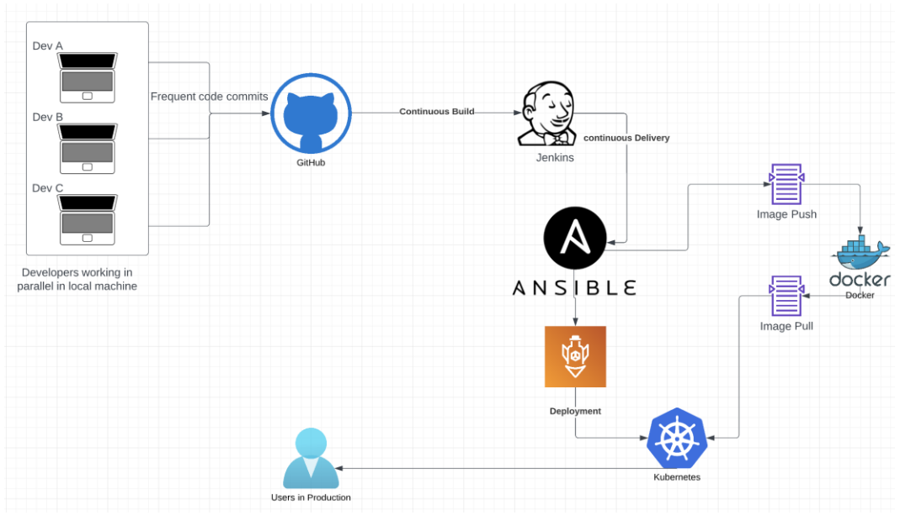

## XYZ Technologies source code

### Introduction

#### Title

This is the source code of my Edureka - Perdue Post Graduate Program in DevOps Industry Grade Project 2. It contains all the code required to deploy the sample application that is used for the project. Bellow is the architectural diagram of the solution we want to implement.


*The project's complete DevOps Architecture*

### Project structure

The project contains the following components :

- `assets`: the folder that contains the architectural diagram of the solution we are going to implement.
- `k8s`: the folder that contains all the ressources that will be deployed in kubernetes (the application itself and the monitoring solution). One should notice that all the monitoring source code is based on an example we worked on in the course. This folder contains 2 main files (`k8s/deployment.yml` and `k8s/service.yml`) which the main kubernetes artifacts for deploying the application. 
- `src`: this folder contains the complete source code of the application. This source code has been provided to us like the starting point of the DevOps project.
- `Dockerfile`: this file contains directives for docker image generation.
- `Jenkinsfile`: this file contains the complete CI/CD that will **compile, test, package** and **hands the packages artifacts to ansible**.
- `pom.xml`: this is the main maven configuration file for the java project.
- `xyz-tech-playbook.yml`: this is the ansible playbook that will build the docker image of the project, push it to docker hub, then deploy the project on kubernetes.
- `monitoring-on-playbook.yml`: this is the ansible playbook that will deploy all kubernetes components to monitor the application.
- `monitoring-off-playbook.yml`: this is the ansible playbook that will destroy all kubernetes components to monitor the application.

### Deploying the application

To deploy the solution, the following steps should be executed:

#### Create the infrastructure of the project

The targeted platform for the project is AWS, so to have all the project created (the Jenkins and Ansible servers, then the EKS cluster) we need to run the [Infrastructure project for XYZ Technologies](https://github.com/Simoganger/edureka-perdue-infra-xyz). The project contains a `README.md` file that give the details on how to run the project.

#### Ansible server configuration

After creating all the resources properly, the first step will be to complete the configuration of the Ansible server. This will be done by following these steps :


```bash
# connect to your AWS account where the resources have been created.
# connect to the instance named Ansible Server
# rename the server to ansible-server
sudo su -
nano /etc/hostname
    > ansible-server

# retart the machine
init 6

# set the password of the user ansadmin that has been created by the infrastructure
sudo su -
passwd ansadmin

# add the new user to sudoers group
visudo
    > ansadmin ALL=(ALL)    NOPASSWD: ALL

# enable password based authentication for this use and reload sshd service
nano /etc/ssh/sshd_config
# PasswordAuthentication no
PasswordAuthentication yes

# reload the sshd service
service sshd reload

# create keys for ansadmin user
sudo su - ansadmin
ssh-keygen

# edit ansible hosts file to add the ansible-server itself as host. Replace the ANSIBLE_PRIVATE_IP_ADDRESS by what ever yours is after terraform execution.
sudo mkdir /etc/ansible
sudo nano /etc/ansible/hosts
    [ansible]
    <ANSIBLE_PRIVATE_IP_ADDRESS>

# copy the ssh key to this same server
cd .ssh
ssh-copy-id <ANSIBLE_PRIVATE_IP_ADDRESS>

# test ansible server connection to hosts
ansible all -m ping

# create a work directory for ansible (we assumed we are still connected with ansadmin user) and assign the directory to the ansible user
cd /opt
sudo mkdir docker
sudo chown ansadmin:ansadmin docker

# restart the docker service
sudo service docker restart

# login to docker hub to have the credentials stored. You need to have an account created on https://hub.docker.com/.
sudo docker login
username:
password:

# configure aws cli to use the same configuration as the machine that creates terraform infra
aws configure
# provide aws access key
# provide aws secret access key

# configure kubectl tool
aws eks update-kubeconfig --name devl --region us-east-2

# test access to the eks cluster by running the following command that will display the nodes of the eks cluster.
kubectl get nodes
```

#### Jenkins server configuration

Now that the Ansible server is up and running, we need to configure the Jenkins server. To do that, we follow the steps bellow:

- Connect to the Jenkins instance on AWS using the console or PuTTY
- Access the Jenkins server using the address `http://<JENKINS_PUBLIC_IP>:8080` (replace the Jenkins server IP address with the appropriate one as generated by the terraform output).
- From the instance command line enter the command `sudo cat /var/lib/jenkins/secrets/initialAdminPassword` and copy the output.
- Enter the password in the input of Jenkins first screen in your browser.
- Choose to install suggested plugins.
- Configure the Java tool (use the name `java` as the name of the tool). `Manage Jenkins > Tool > Add JDK`
- Install the *Maven Integration* plugin and configure the Maven tool (use the name `maven` for the tool). `Manage Jenkins > Plugins > Available Plugins > Search for Maven Integration > Install`. Then `Manage Jenkins > Tool > Add Maven` and specify name and `MAVEN_HOME`
- Install the *Publish Over SSH* plugin and configure an SSH server indicating the name as *ansible-server*, his public IP address and the authentication informations. `Manage Jenkins > Plugins > Available Plugins > Search for Publish Over SSH > Install`. Then `Manage Jenkins > System > SSH Server`
- Create a Jenkins pipeline that pulls code from GitHub. `New Item > Pipeline > Pipeline script from SCM` and choose Git as SCM, then enter the url to the remote repository.
- Configure a webhook on GitHub.

#### Monitoring solution configuration

The monitoring solution can be configured using the following steps. We are going to do all the manipulation from the ansible server and from the `/opt/docker` directory which is our working directory where Jenkins has copied all the necessary files. Most of these commands are automated by simply running the `monitoring-playbook.yml` ansible playbook file using the command `ansible-playbook monitoring-playbook.yml`. But to use the playbook, you should make sure to update all the required files with the informations from your AWS account and resources created from terraform.

```bash
# change k8s/prometheus-agent/0-service-account.yaml IAM role arn
# arn:aws:iam::<YOUR_ACCOUNT_ID>:role/prometheus-devl

# change the prometheus write URL in the k8s/prometheus-agent/4-prometheus.yaml file (you can get this from AWS console)
# url: https://aps-workspaces.us-east-2.amazonaws.com/workspaces/ws-3f8cc59e-f395-432e-af0d-0ff1f2259708/api/v1/remote_write

# change IAM role ARN in k8s/grafana/0-service-account.yaml get arn for role grafana-devl
# arn:aws:iam::<YOUR_ACCOUNT_ID>:role/grafana-devl

# update k8s/grafana/1-secret.yaml (if you want to change it)
# first admin-password
echo -n "devops123" | base64

# second admin-user
echo -n admin | base64

# replace prometheus query url in k8s/grafana/3-datasources.yaml remove /api/v1/query
# url: https://aps-workspaces.us-east-2.amazonaws.com/workspaces/ws-3f8cc59e-f395-432e-af0d-0ff1f2259708

# run the monitoring-playbook.yml
ansible-playbook monitoring-playbook.yml

# on your local machine, run port forwarding for prometheus
kubectl -n monitoring port-forward svc/prometheus-operated 9090

# on your local machine, forward grafana port to be able to view the dashboard
kubectl -n monitoring port-forward svc/grafana 3000

# now on your local machine enter http://localhost:3000 to have grafana dashboard and http://localhost:9090 to have prometheus raw dashboard
```
